# Spark Operations Bot
Spark Operations Bot, also known as Cisco Infrastructure Chat Ops (CICO).

This bot leverages the Spark Bot framework found [here](https://github.com/imapex/ciscosparkbot). It has two primary functions:

1. The bot is able to provide an overall health of your environment, which can include Meraki, Spark Calling, and Umbrella. It will tell you if you have any network devices down in your Meraki network, and optionally give you a way to cross-launch directly into the Meraki dashboard to troubleshoot. It will show how many phones are configured in Spark Call, and how many are offline by device type. And, it will show you if there is any malicious traffic detected by Umbrella.
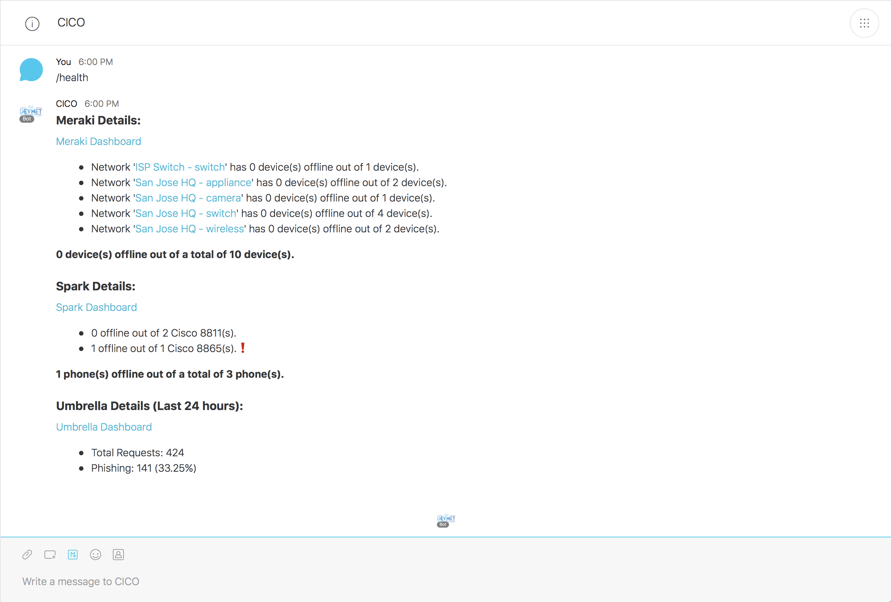

2. The bot is able to give you a status of an individual user, which can include Meraki, Spark Calling, and Umbrella. It will show you the device(s) detected for that user in the Meraki dashboard clients list (also including Systems Manager if available), optionally giving you a way to cross-launch directly into the Meraki dashboard to troubleshoot any issues on the network device. It also lists any phones configured for that user in Spark Call, also with an optional link to cross-launch back into the Meraki dashboard for troubleshooting. Finally, it is able to show you whether there is any malicious traffic detected for that specific user in Umbrella.
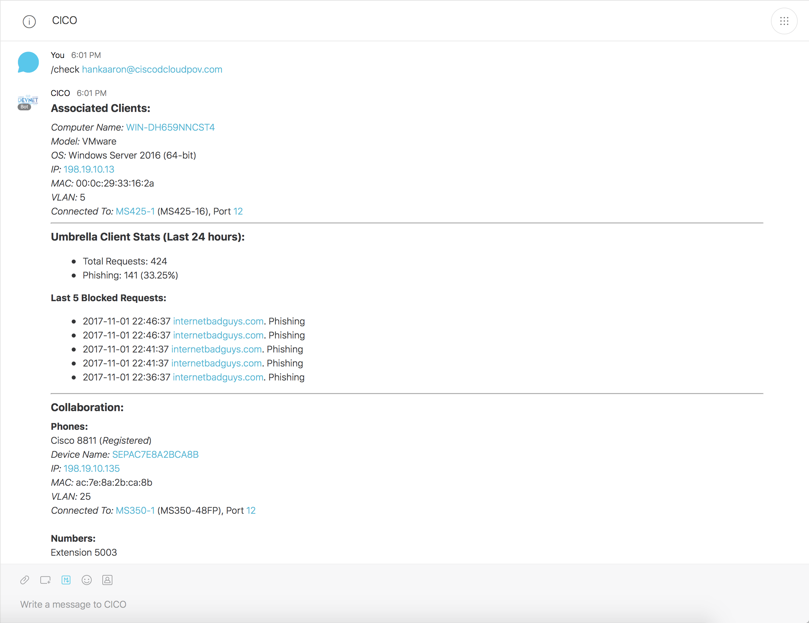

# Contents
- [Prerequisites](#prerequisites)
- [Installation](#installation)
  - [ngrok](#ngrok)
- [Meraki Integration](#meraki)
  - [Enable API Access](#meraki-api-access)
  - [Get API Token](#meraki-api-token)
  - [Get Organization ID](#meraki-org-id)
  - [Environment](#meraki-env-setup)
- [Spark Call Integration](#sparkcall)
  - [Verify Admin Rights](#sparkcall-admin)
  - [Get API Token](#sparkcall-token)
  - [Environment](#sparkcall-env-setup)
- [Umbrella Integration](#umbrella)
  - [Create S3 Bucket](#umbrella-s3)
  - [Enable S3 Log Export](#umbrella-export)
  - [Create S3 API User](#umbrella-s3-api)
  - [Set S3 Lifecycle](#umbrella-s3-retention)
  - [Environment](#umbrella-env-setup)
- [AMP for Endpoints Integration](#a4e)
  - [Create API Credential](#a4e-token)
- [Bot Usage](#usage)
  - [Execute Locally](#local-run)
  - [Docker](#docker-run)
  - [Heroku](#heroku-run)


# Prerequisites<a name="prerequisites"/>

If you don't already have a Cisco Spark account, go ahead and register for one.  They are free.
You'll need to start by adding your bot to the Cisco Spark website.

[https://developer.ciscospark.com/add-app.html](https://developer.ciscospark.com/add-app.html)


1. Click create bot


2. Fill out all the details about your bot, including a publicly hosted avatar image.  A sample avatar is available at [http://cs.co/devnetlogosq](http://cs.co/devnetlogosq).


3. Click "Add Bot", make sure to copy your access token, you will need this in a second


# Installation<a name="installation"/>

Create a virtualenv and install the module

```
virtualenv venv
source venv/bin/activate
pip install -r requirements.txt
git clone https://github.com/meraki/spark-operations-bot.git
```

## ngrok - Skip this step if you already have an Internet reachable web-server<a name="ngrok"/>

ngrok will make easy for you to develop your code with a live bot.

If you are running a Mac with Homebrew, you can easily install via "brew cask install ngrok". Additional installation instructions can be found here: https://ngrok.com/download

After you've installed ngrok, in another window start the service


`ngrok http 5000`


You should see a screen that looks like this:

```
ngrok by @inconshreveable                                                                                                                                 (Ctrl+C to quit)

Session Status                online
Version                       2.2.4
Region                        United States (us)
Web Interface                 http://127.0.0.1:4040
Forwarding                    http://this.is.the.url.you.need -> localhost:5000
Forwarding                    **https://this.is.the.url.you.need** -> localhost:5000

Connections                   ttl     opn     rt1     rt5     p50     p90
                              2       0       0.00    0.00    0.77    1.16

HTTP Requests
-------------

POST /                         200 OK
```

# Meraki Integration<a name="meraki"/>

---

## Enable your Meraki organization for API Access<a name="meraki-api-access"/>

1. Log in to the Meraki Dashboard. Choose your organization if prompted to do so.

2. On the left Navigation bar, go to Organization and select Settings.

3. Scroll down to the Dashboard API Access section, and turn on API Access.


## Obtain your Meraki API Token<a name="meraki-api-token"/>

1. Log in to the Meraki Dashboard. Choose your organization if prompted to do so.

2. Under your username, select My profile


3. Scroll down to the API access section, and copy your API key. You'll need it to get your Organization ID and to set your environment variables.


## Obtain your Meraki Organization ID<a name="meraki-org-id"/>

If you have only a single Organization, this step is not required. If you have multiple Organizations, and you do not provide this value, the first network (alphabetically) will be used. You can use Postman to run this GET:


Or you can do it from the command line, with a curl command like this:

`curl --header "X-Cisco-Meraki-API-Key: put-your-meraki-api-token-here" https://dashboard.meraki.com/api/v0/organizations/`

You should see output with one or more networks like this:

```
[{"id":your-meraki-org-id-here,"name":"Your Meraki Network"}]
```

Copy your Meraki organization ID to use for the environment variables below.

## Environment<a name="meraki-env-setup"/>

Note: This bot has only been tested with a "Combined" Meraki Network or a standalone Meraki SM Network (no 'health' information is shown for SM-only networks). If you attempt to use the bot with separate wired/wireless/appliance networks, it will likely not work correctly.

### Create Combined Network (if your network is not already configured this way)

1. Log in to the Meraki Dashboard. Choose your oganization if prompted to do so.

2. On the left navigation pane, locate the dropdown arrow representing the currently selected Network.

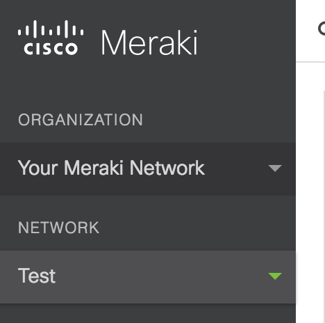

3. Click the dropdown arrow, then select View All Networks.

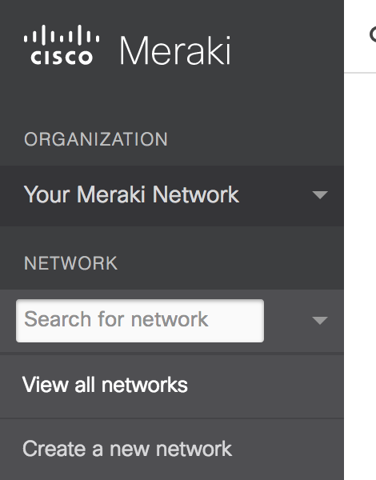

4. Check the boxes for the networks that you wish to combine (may be some or all depending on your specific needs). Next, click on the "Combine" dropdown.

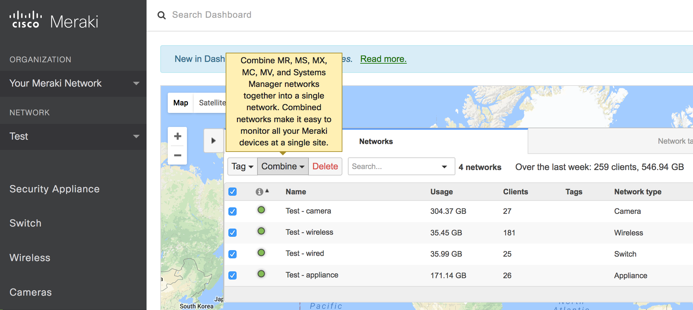

5. Enter a new name for your combined network, and click the Combine button.

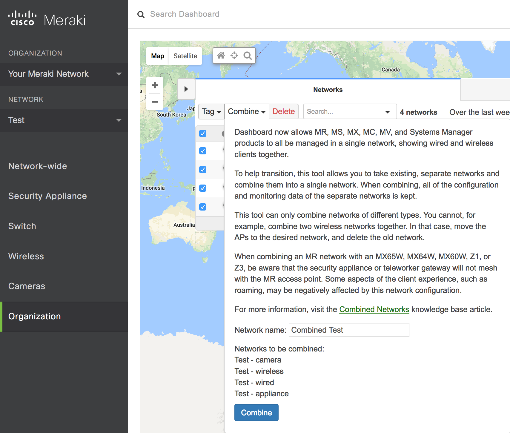

### Verify client naming conventions (to understand/change how the bot locates users in the network)

1. Log in to the Meraki Dashboard. Choose your oganization if prompted to do so.

2. On the left navigation pane, navigate to Network-Wide and Clients.

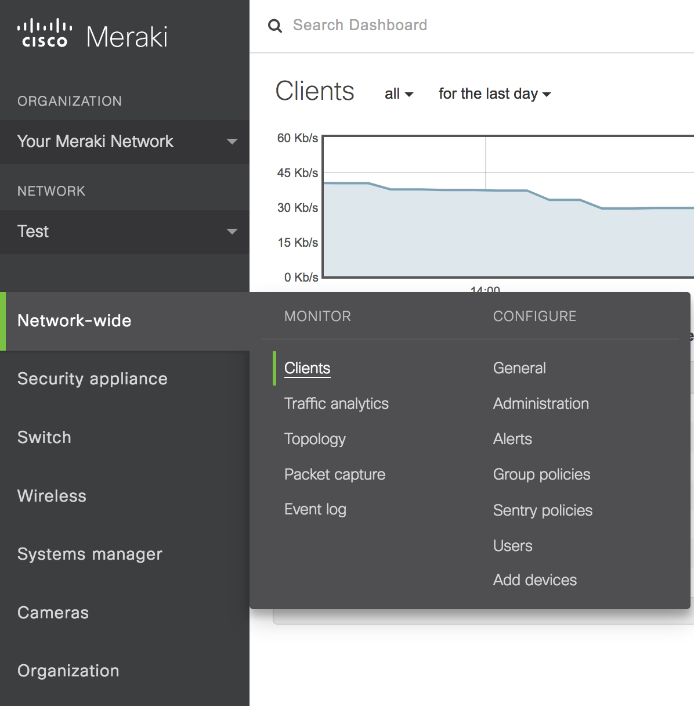

3. Select a client from the list of clients.

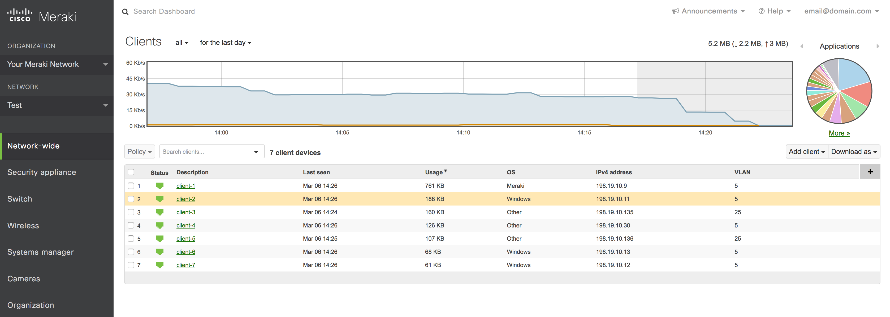

4. By default, when performing a "check &lt;username&gt;", the bot should match the currently displayed name for the selected client. This should match the host name of the client. You might want to search for users by username, which means that the clients will have to be renamed to represent the username of each respective client. In order to change the selected client's name, click the pencil icon next to the name of the client.


5. Set a new name for the client, then click Save.

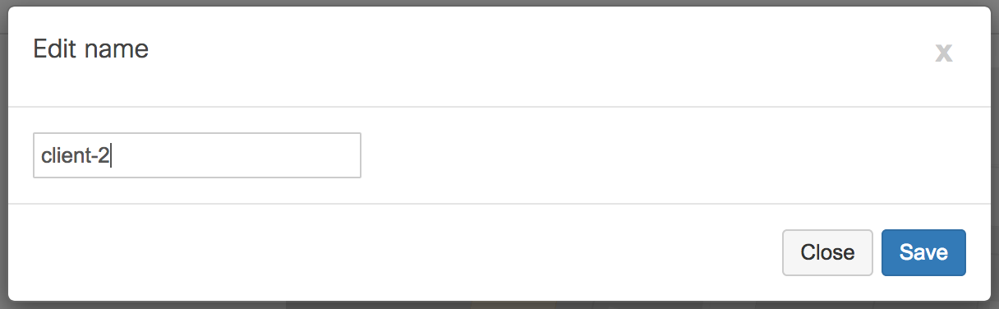

### Verify Systems Manager client naming conventions (optional; if you use SM, you can also coorelate SM data alongisde network client data)

1. Log in to the Meraki Dashboard. Choose your oganization if prompted to do so.

2. On the left navigation pane, navigate to Systems Manager and Clients

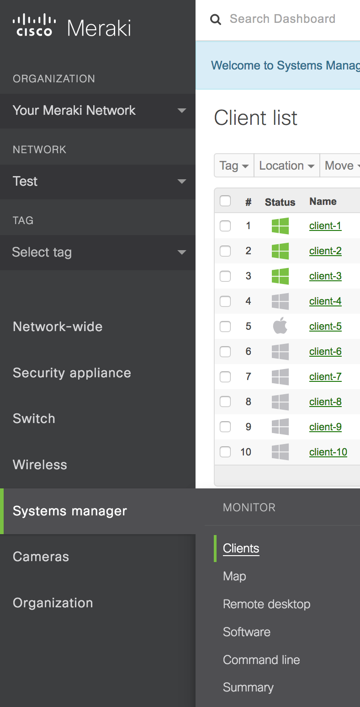

3. Select a client from the list of clients.

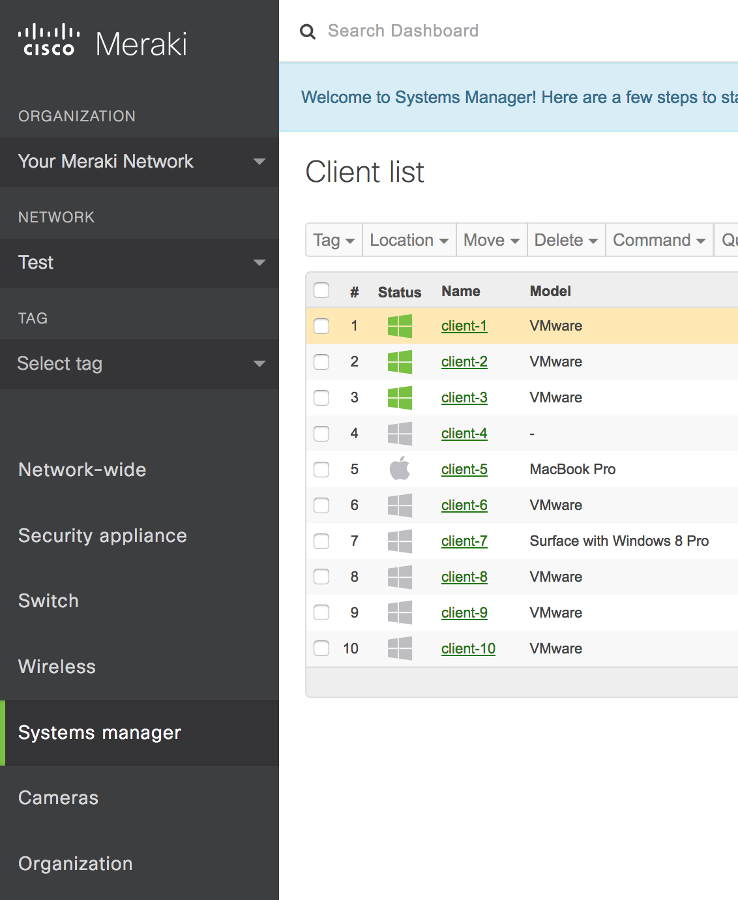

4. By default, when performing a "check &lt;username&gt;", the bot should match the currently displayed name for the selected client. This should match the host name of the client. You might want to search for users by username, which means that the clients will have to be renamed to represent the username of each respective client. In order to change the selected client's name, click the Edit Details link next at the top right of the Client Details section.

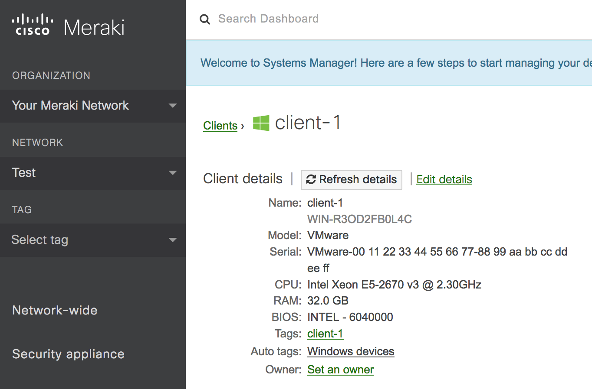

5. In order to coorelate client details to the network client, the name of the network client must match the name of the SM client. Set a name to match the network client, then click Save.

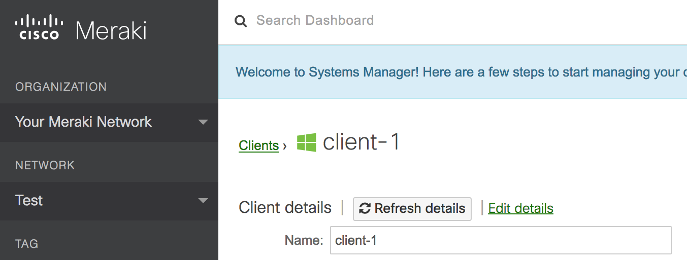
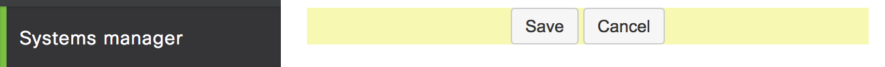

# Spark Call Integration<a name="sparkcall"/>

Note: The Spark Call APIs being used have not been officially published. As such, they are subject to change at any time without notification.
---

## Verify Spark Call Administrator Privileges<a name="sparkcall-admin"/>

Go to https://admin.ciscospark.com, and log in with a user that has Full Admin rights to your Spark Call organization.

Select Users on the left, then find your Admin user and click on that user. An overview box will slide in.


Click "Roles and Security"


Ensure that your Admin user has "Full administrator privileges" marked

## Obtain your Spark Call Administrator Token<a name="sparkcall-token"/>

Go to https://developer.ciscospark.com, and log in with a user that has Full Admin rights to your Spark Call organization.

In the upper right, click the user portrait, then click the "Copy" button to copy your Token for the environment variables below.


## Environment<a name="sparkcall-env-setup"/>

By default, when performing a "check &lt;username&gt;", the bot will match clients in Spark Call where some portion of the First Name, Last Name, User Name, or Display Name match.

1. Log in to the Spark Call Dashboard.

2. On the left navigation pane, click on Users. From the list, you can see the First Name, Last Name, Display Name, and Email for the clients.

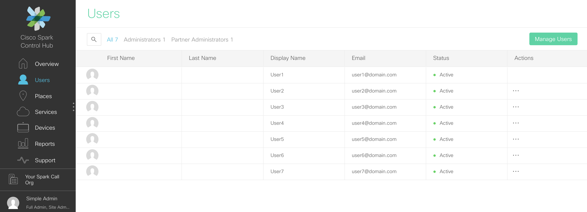

3. Select a user from the list of users.

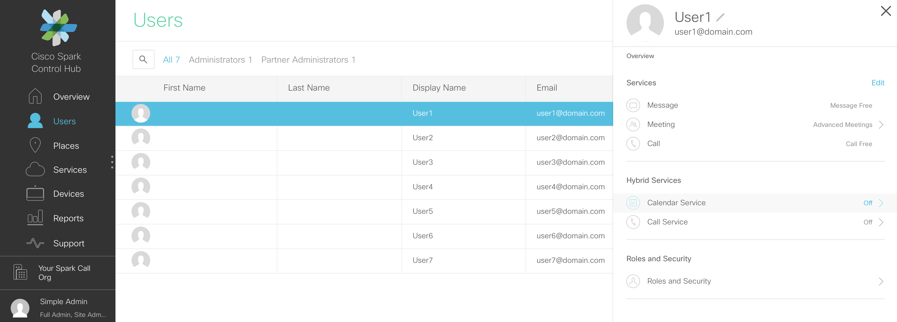

4. Update the First Name, Last Name, or Display Name as desired, then click Save.

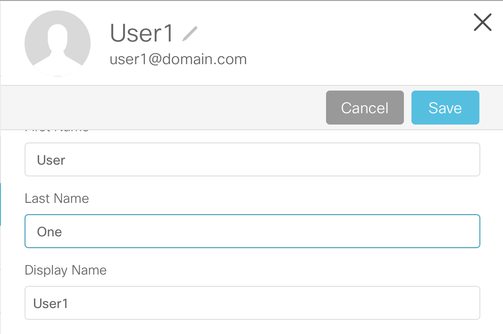

# Umbrella Integration<a name="umbrella"/>

## Create S3 Bucket<a name="umbrella-s3"/>

Please reference the Umbrella documentation for information on how to set up your S3 bucket.
[https://support.umbrella.com/hc/en-us/articles/231248448-Cisco-Umbrella-Log-Management-in-Amazon-S3](https://support.umbrella.com/hc/en-us/articles/231248448-Cisco-Umbrella-Log-Management-in-Amazon-S3)

## Enable S3 Log Export<a name="umbrella-export"/>

Please reference the Umbrella documentation for information on how to enable S3 Log Export.
[https://support.umbrella.com/hc/en-us/articles/231248448-Cisco-Umbrella-Log-Management-in-Amazon-S3](https://support.umbrella.com/hc/en-us/articles/231248448-Cisco-Umbrella-Log-Management-in-Amazon-S3)

## Create S3 API User<a name="umbrella-s3-api"/>

Access Amazon Identiy and Access Management (IAM) here:
[https://console.aws.amazon.com/iam](https://console.aws.amazon.com/iam)
<br>Click on the link for Users: 1 (or, whatever quantity of users you have defined)


Click Add User


Give your user a name, and check the box for "Programmatic access"


Click the button for "Attach existing policies directly", then search for or scroll to AmazonS3ReadOnlyAccess, and check the box next to that. Then click Next.


Verify the settings, then click Create user.


Save your Access Key ID and Secret Access Key to add to the required Environment Variables.


## Set S3 Lifecycle<a name="umbrella-s3-retention"/>

In Amazon AWS, access the bucket you are utilizing for Umbrella log exports. Click on the Management tab after selecting the bucket.
<br>Click "Add lifecycle rule"


Give your lifecycle a rule, then click through until the Expiration tab.


Check "Current version", check "Expire current version of object", and set the duration to 1 day. Click through and save the lifecycle rule.


## Environment<a name="umbrella-env-setup"/>

By default, when performing a "check &lt;username&gt;", the bot will match clients in Umbrella based on their host name.

1. Log in to the Umbrella Dashboard.

2. On the left navigation pane, click on Identities and Roaming Computers.

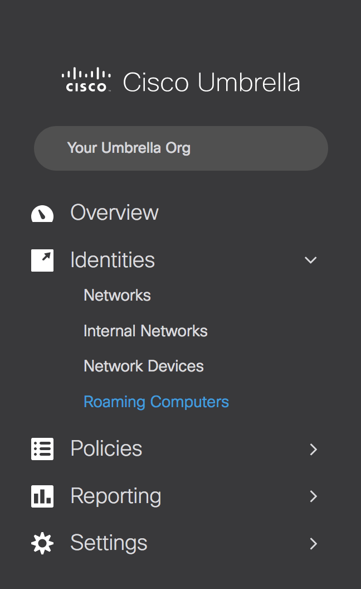

3. Select a user from the list of users.

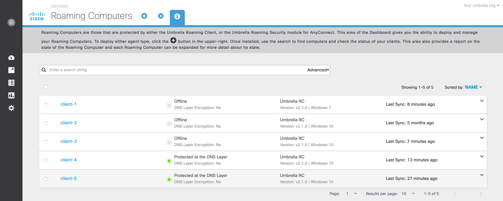

4. Update the client name as desired, then click Save.

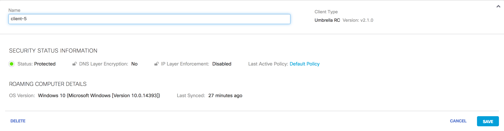

# AMP for Endpoints Integration<a name="a4e"/>

## Create an A4E API Credential<a name="a4e-token"/>

Go to https://console.amp.cisco.com, and log in with a user that has Full Admin rights to your AMP for Endpoints organization.

In the top menu, click Accounts dropdown menu, then click the "API Credentials" menu option.

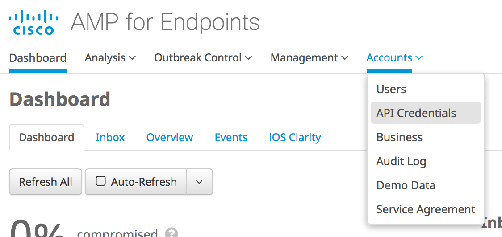

Click the button for "New API Credential".

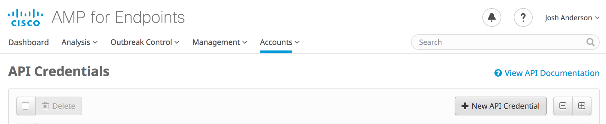

Give your API Credential a recognizable name, leave the Scope as "Read-only", then click the "Create" button.

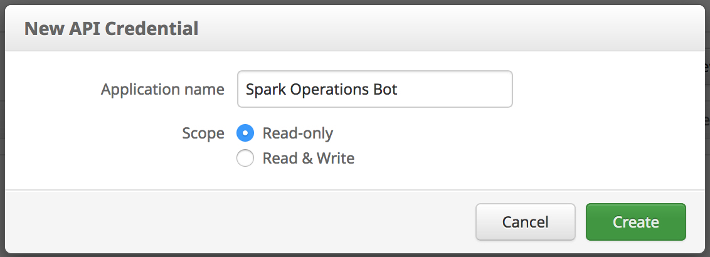

Save the Client ID and API Key for the environment variables below.

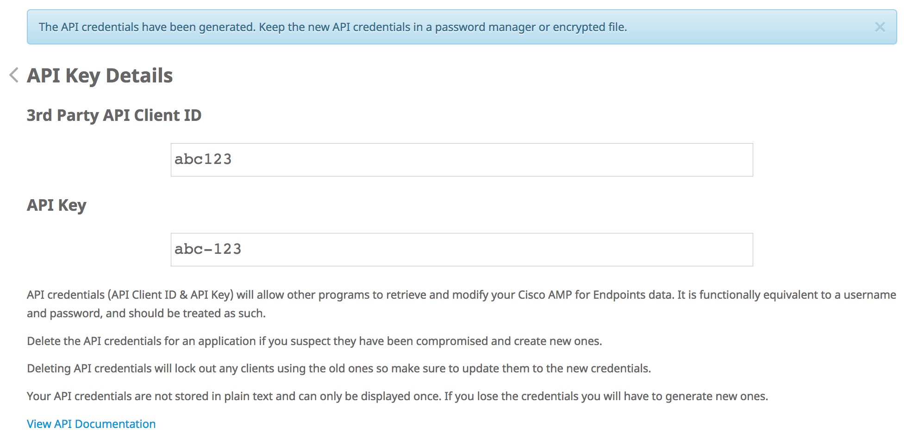


# Bot Usage<a name="usage"/>

There are several ways to run the bot. Use one of the methods below to start up the bot. Once it's running, you can start interacting with it!
If you are in a 1:1 space with your bot, you can simply type either health or check <username>. If you are in a group, you will first need to @mention your bot, followed by health or check <username>.

## Execute Locally<a name="local-run">

The easiest way to use this module is to set a few environment variables. On Windows, use "set" instead of "export". See the ngrok section below if you do not have a web server already facing the Internet. These are the Environment variables that are required to run the bot itself (app.py):

```
# Required for Bot Operation
export SPARK_BOT_URL=https://mypublicsite.io  *(your public facing webserver, or the forwarding address from ngrok)*
export SPARK_BOT_TOKEN=<your bot token>
export SPARK_BOT_EMAIL=<your bot email>
export SPARK_BOT_APP_NAME=<your bot name>
export SPARK_BOT_HELP_MSG=<Optional, used to customize Bot Help Banner>
# Enable Meraki Integration
export MERAKI_API_TOKEN=<Meraki Dashboard API token>
export MERAKI_ORG=<Meraki Dashboard Organization ID>
export MERAKI_HTTP_USERNAME=<Optional; Meraki Dashboard username>
export MERAKI_HTTP_PASSWORD=<Optional; Meraki Dashboard password>
# Enable Spark Call Integration
export SPARK_API_TOKEN=<Spark Call Admin API token>
# Enable Umbrella Integration
export S3_BUCKET=<Amazon S3 bucket name; used for Umbrella log import>
export S3_ACCESS_KEY_ID=<Amazon S3 access key ID; used for Umbrella log import>
export S3_SECRET_ACCESS_KEY=<Amazon S3 secret access key; used for Umbrella log import>
# Enable AMP for Endpoints Integration
export A4E_CLIENT_ID=<AMP for Endpoints 3rd Party API Client ID>
export A4E_CLIENT_SECRET=<AMP for Endpoints API Key>
```

Now launch your bot!!

`python app.py`

## Docker<a name="docker-run">

First, make a copy of the .env.sample file, naming it .env, and editing it to set your environment variables.

You can build the container yourself:
```
docker build -t joshand/spark-operations-bot .
docker run -p 5000:5000 -it --env-file .env joshand/spark-operations-bot
```

Or, you can use the published container:
```
./start.sh
```

## Heroku<a name="heroku-run">

[](https://heroku.com/deploy)