# CICO
Cisco Infrastructure Chat Ops

This bot leverages the Spark Bot framework found [here](https://github.com/imapex/ciscosparkbot).

# Contents
- [Prerequisites](#prerequisites)
- [Installation](#installation)
  - [ngrok](#ngrok)
- [Meraki Integration](#meraki)
  - [Enable API Access](#meraki-api-access)
  - [Get API Token](#meraki-api-token)
  - [Get Organization ID](#meraki-org-id)
  - [Get Dashboard Links (Optional)](#meraki-dashboard-links)
- [Spark Call Integration](#sparkcall)
  - [Verify Admin Rights](#sparkcall-admin)
  - [Get API Token](#sparkcall-token)
- [Umbrella Integration](#umbrella)
  - [Create S3 Bucket](#umbrella-s3)
  - [Enable S3 Log Export](#umbrella-export)
  - [Create S3 API User](#umbrella-s3-api)
  - [Set S3 Lifecycle](#umbrella-s3-retention)
  - [Run S3 Log Import](#umbrella-s3-import)
- [Usage](#usage)


# Prerequisites<a name="prerequisites"/>

If you don't already have a Cisco Spark account, go ahead and register for one.  They are free.
You'll need to start by adding your bot to the Cisco Spark website.

[https://developer.ciscospark.com/add-app.html](https://developer.ciscospark.com/add-app.html)

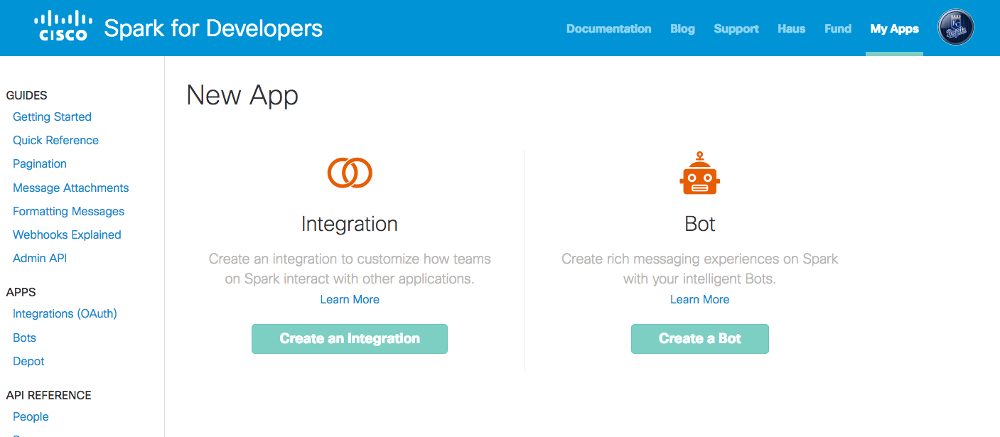

1. Click create bot

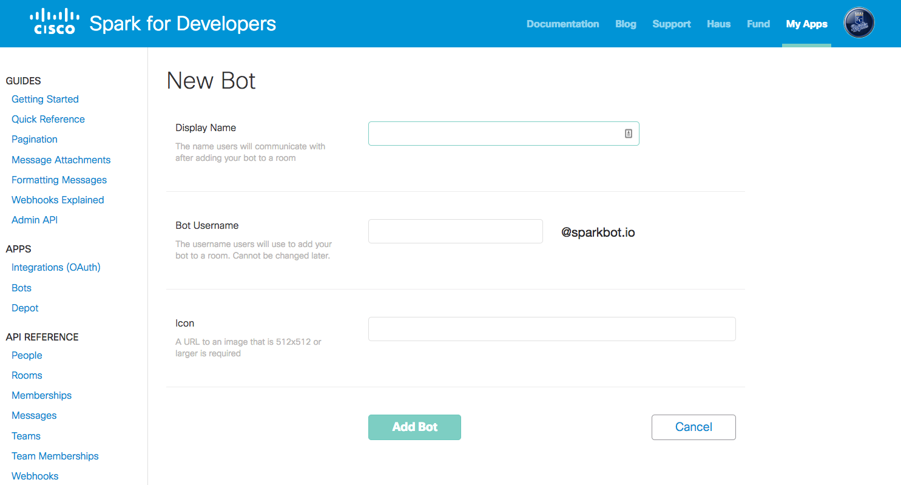

2. Fill out all the details about your bot, including a publicly hosted avatar image.  A sample avatar is available at [http://cs.co/devnetlogosq](http://cs.co/devnetlogosq).

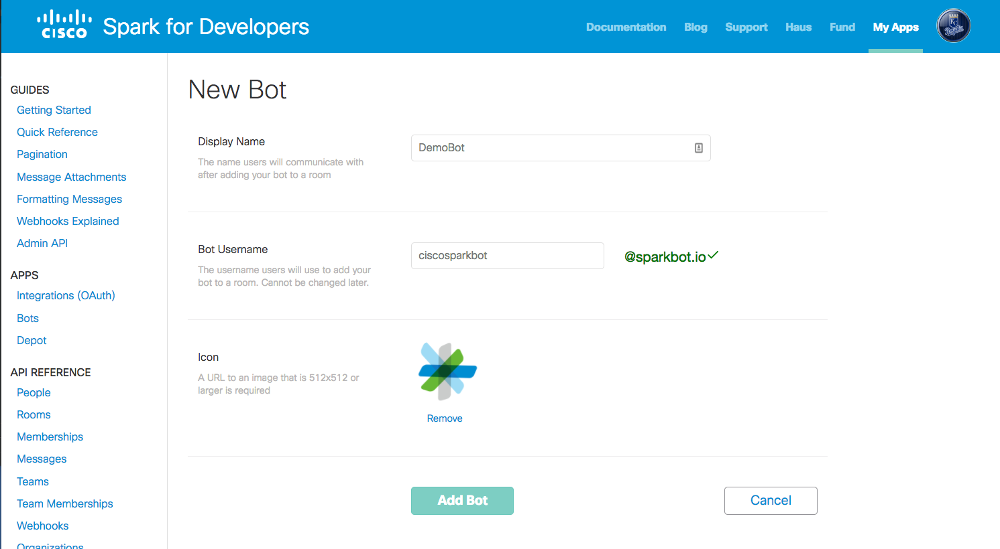

3. Click "Add Bot", make sure to copy your access token, you will need this in a second

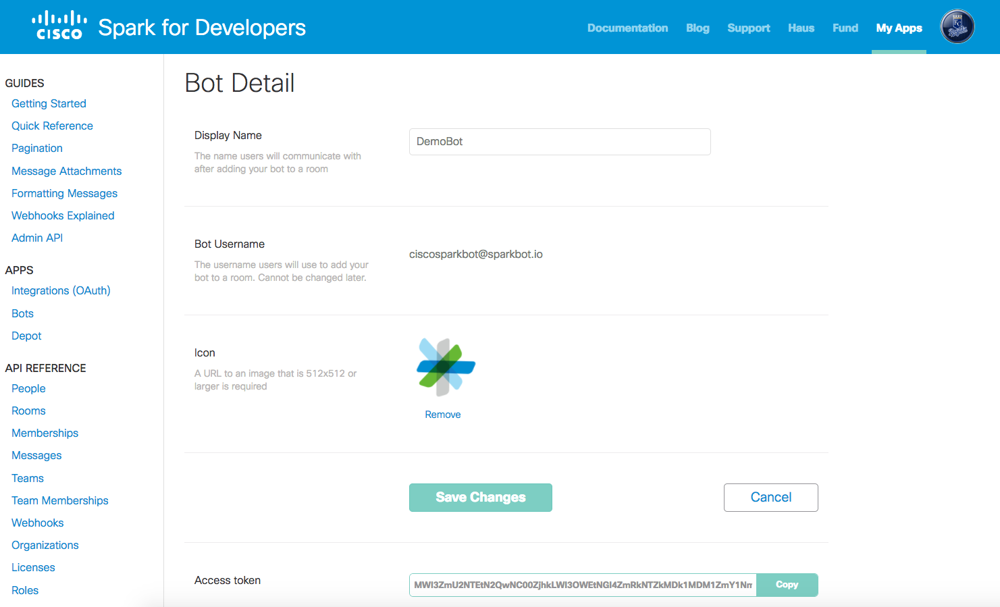

# Installation<a name="installation"/>

Create a virtualenv and install the module

```
virtualenv venv
source venv/bin/activate
pip install ciscosparkbot
git clone https://github.com/joshand/CICO.git
```

## ngrok - Skip this step if you already have an Internet reachable web-server<a name="ngrok"/>

ngrok will make easy for you to develop your code with a live bot.

If you are running a Mac with Homebrew, you can easily install via "brew cask install ngrok". Additional installation instructions can be found here: https://ngrok.com/download

After you've installed ngrok, in another window start the service


`ngrok http 5000`


You should see a screen that looks like this:

```
ngrok by @inconshreveable                                                                                                                                 (Ctrl+C to quit)

Session Status                online
Version                       2.2.4
Region                        United States (us)
Web Interface                 http://127.0.0.1:4040
Forwarding                    http://this.is.the.url.you.need -> localhost:5000
Forwarding                    **https://this.is.the.url.you.need** -> localhost:5000

Connections                   ttl     opn     rt1     rt5     p50     p90
                              2       0       0.00    0.00    0.77    1.16

HTTP Requests
-------------

POST /                         200 OK
```

# Meraki Integration<a name="meraki"/>

---

## Enable your Meraki organization for API Access<a name="meraki-api-access"/>

1. Log in to the Meraki Dashboard. Choose your organization if prompted to do so.

2. On the left Navigation bar, go to Organization and select Settings.

3. Scroll down to the Dashboard API Access section, and turn on API Access.

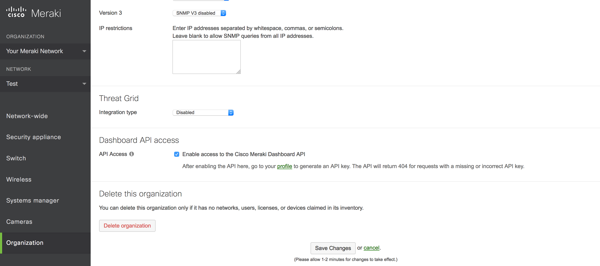

## Obtain your Meraki API Token<a name="meraki-api-token"/>

1. Log in to the Meraki Dashboard. Choose your organization if prompted to do so.

2. Under your username, select My profile

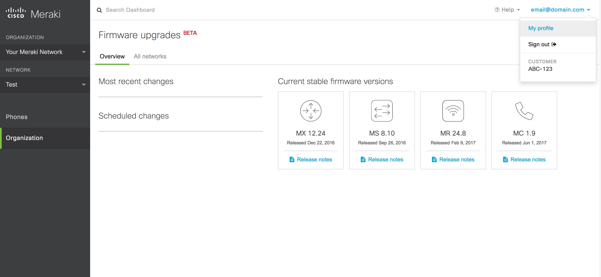

3. Scroll down to the API access section, and copy your API key. You'll need it to get your Organization ID and to set your environment variables.

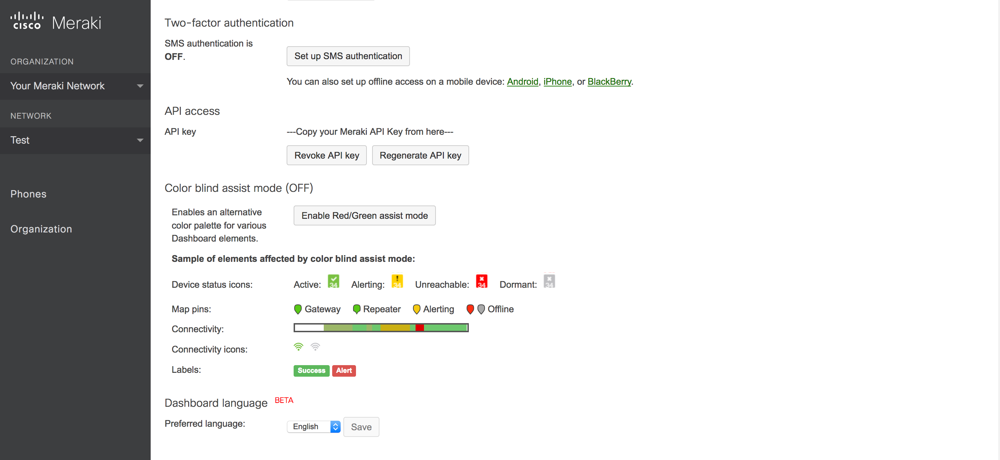

## Obtain your Meraki Organization ID<a name="meraki-org-id"/>

You can use Postman to run this GET:

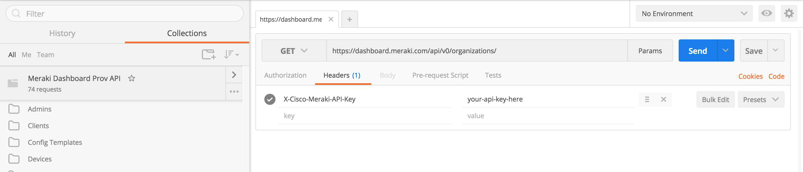

Or you can do it from the command line, with a curl command like this:

`curl --header "X-Cisco-Meraki-API-Key: put-your-meraki-api-token-here" https://dashboard.meraki.com/api/v0/organizations/`

You should see output with one or more networks like this:

```
[{"id":your-meraki-org-id-here,"name":"Your Meraki Network"}]
```

Copy your Meraki organization ID to use for the environment variables below.

## Get Dashboard Links (Optional)<a name="meraki-dashboard-links"/>

The bot can be configured to show links on certain elements (clients, devices, networks) to cross-launch back into the Meraki dashboard. However, this data is not currently exposed via the Meraki API. If you would like to create the required linkages (which is an optional step as the bot will function without it), utilize the meraki_dashboard_link_parser.py script to do so. This script will need to be re-run any time you make changes to your Meraki network or device configuration. In order to run this script, you will first need to set the following environment variables:
```
export MERAKI_HTTP_USERNAME=<Meraki Dashboard username>
export MERAKI_HTTP_PASSWORD=<Meraki Dashboard password>
export MERAKI_API_TOKEN=<Meraki Dashboard API token>
export MERAKI_ORG=<Meraki Dashboard Organization ID>
```
If you are running the bot (app.py) from the same session that you are running meraki_dashboard_link_parser.py from, the MERAKI_DASHBOARD_MAP environment variable will automatically be populated with the mapping data. If you are running them in seperate environments, ensure that you take the output from the meraki_dashboard_link_parser.py script and set your environment variable (MERAKI_DASHBOARD_MAP) with it.

# Spark Call Integration<a name="sparkcall"/>

---
Note: The Spark Call APIs being used have not been officially published. As such, they are subject to change at any time without notification.
---

## Verify Spark Call Administrator Privileges<a name="sparkcall-admin"/>

Go to https://admin.ciscospark.com, and log in with a user that has Full Admin rights to your Spark Call organization.

Select Users on the left, then find your Admin user and click on that user. An overview box will slide in.

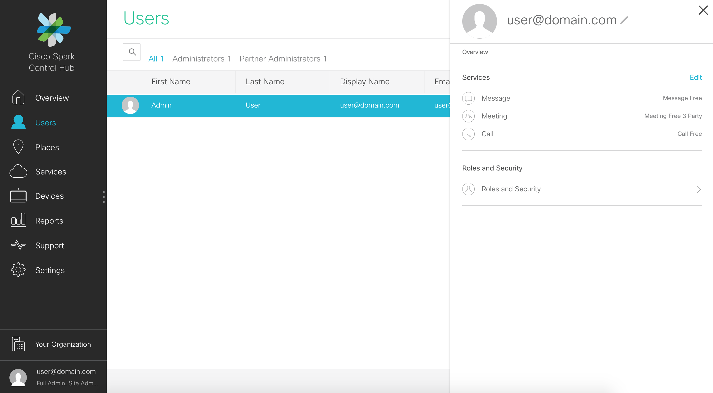

Click "Roles and Security"

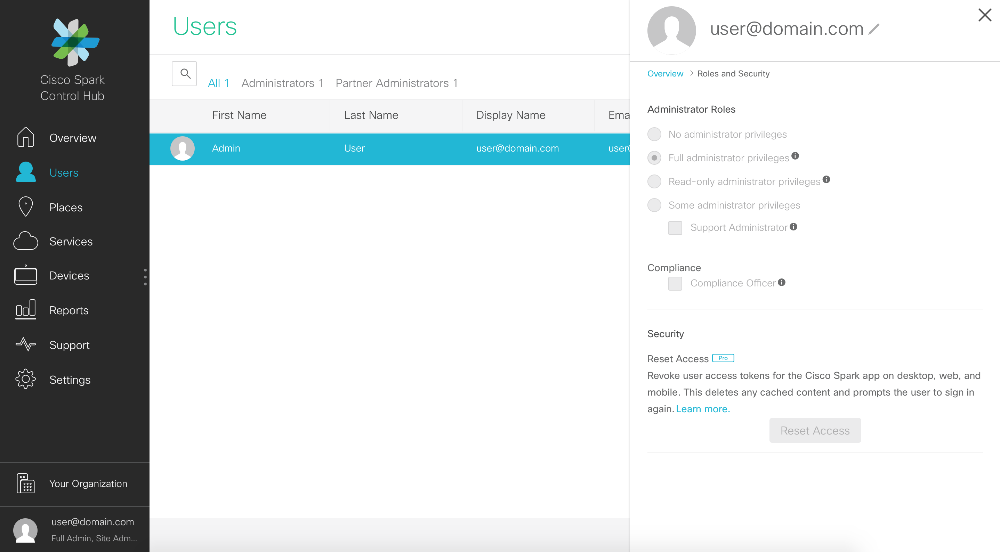

Ensure that your Admin user has "Full administrator privileges" marked

## Obtain your Spark Call Administrator Token<a name="sparkcall-token"/>

Go to https://developer.ciscospark.com, and log in with a user that has Full Admin rights to your Spark Call organization.

In the upper right, click the user portrait, then click the "Copy" button to copy your Token for the environment variables below.

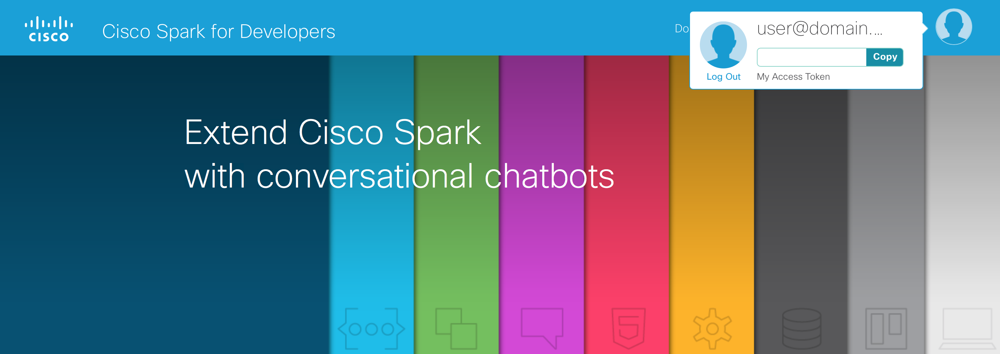

# Umbrella Integration<a name="umbrella"/>

## Create S3 Bucket<a name="umbrella-s3"/>

Please reference the Umbrella documentation for information on how to set up your S3 bucket.
[https://support.umbrella.com/hc/en-us/articles/231248448-Cisco-Umbrella-Log-Management-in-Amazon-S3](https://support.umbrella.com/hc/en-us/articles/231248448-Cisco-Umbrella-Log-Management-in-Amazon-S3)

## Enable S3 Log Export<a name="umbrella-export"/>

Please reference the Umbrella documentation for information on how to enable S3 Log Export.
[https://support.umbrella.com/hc/en-us/articles/231248448-Cisco-Umbrella-Log-Management-in-Amazon-S3](https://support.umbrella.com/hc/en-us/articles/231248448-Cisco-Umbrella-Log-Management-in-Amazon-S3)

## Create S3 API User<a name="umbrella-s3-api"/>

Access Amazon Identiy and Access Management (IAM) here:
[https://console.aws.amazon.com/iam](https://console.aws.amazon.com/iam)
<br>Click on the link for Users: 1 (or, whatever quantity of users you have defined)

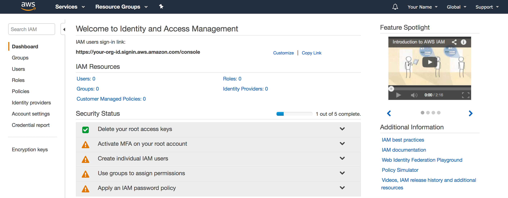

Click Add User

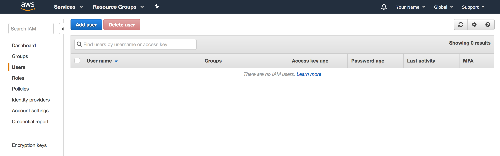

Give your user a name, and check the box for "Programmatic access"

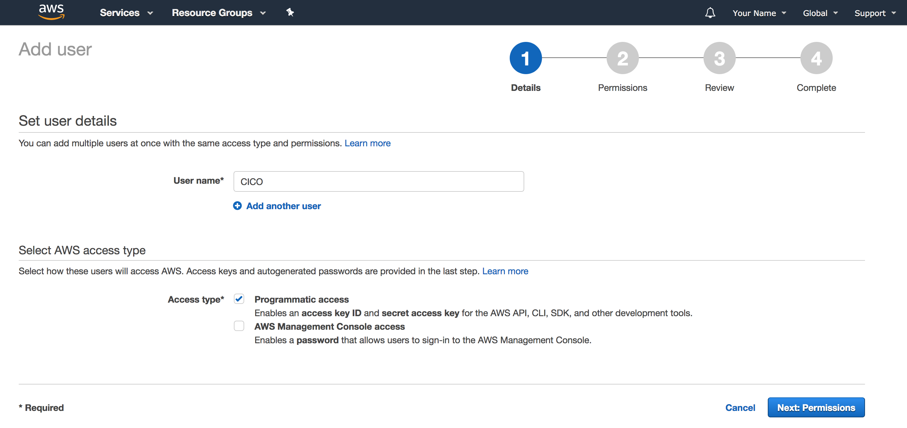

Click the button for "Attach existing policies directly", then search for or scroll to AmazonS3ReadOnlyAccess, and check the box next to that. Then click Next.

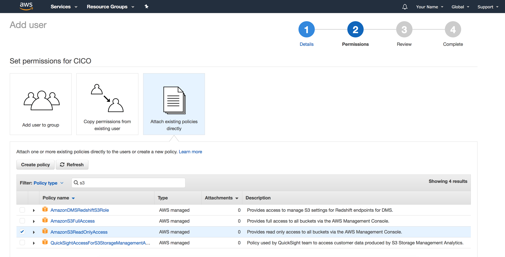

Verify the settings, then click Create user.

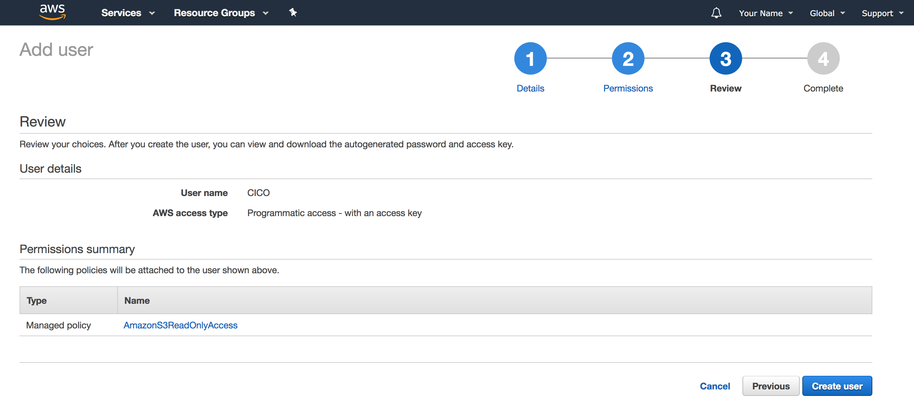

Save your Access Key ID and Secret Access Key to add to the required Environment Variables.

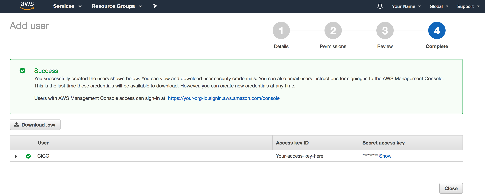

## Set S3 Lifecycle<a name="umbrella-s3-retention"/>

In Amazon AWS, access the bucket you are utilizing for Umbrella log exports. Click on the Management tab after selecting the bucket.
<br>Click "Add lifecycle rule"

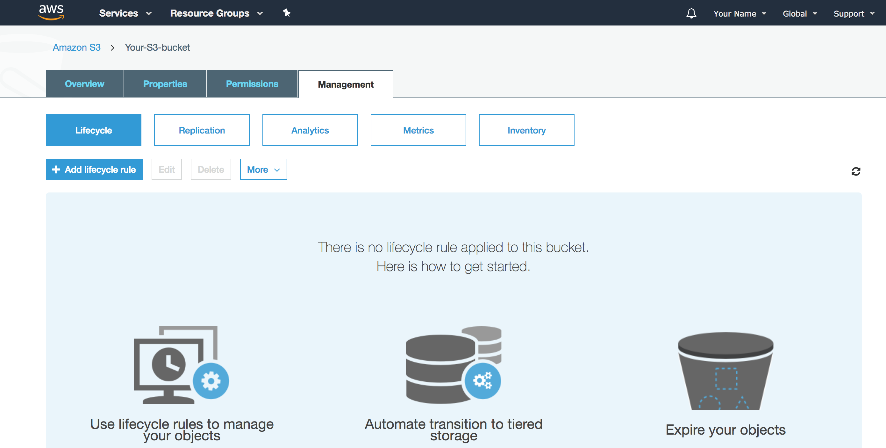

Give your lifecycle a rule, then click through until the Expiration tab.

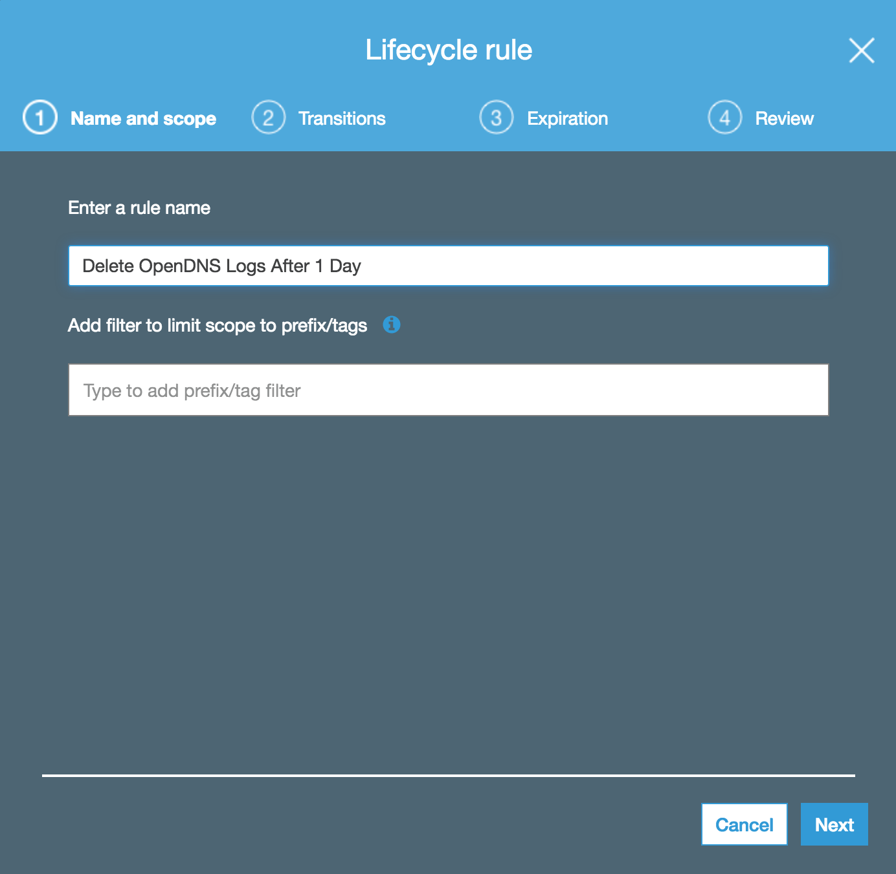

Check "Current version", check "Expire current version of object", and set the duration to 1 day. Click through and save the lifecycle rule.

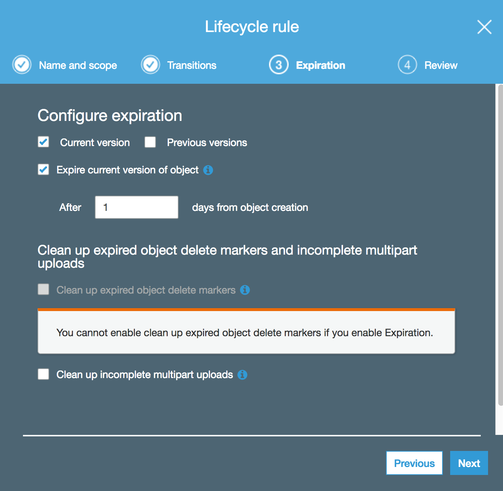

## Run S3 Log Import<a name="umbrella-s3-import"/>

The umbrella_log_collector.py script is designed to run every 5 minutes and ensure that your local logs are in sync with the logs that are avaialble in Amazon S3. All logs are sync'd locally in order to provide quick access time to the data. Before running the script, you will need to ensure that the following Environment variables are set:
```
export S3_BUCKET=<Amazon S3 bucket name>
export S3_ACCESS_KEY_ID=<Amazon IAM Access Key ID>
export S3_SECRET_ACCESS_KEY=<Amazon IAM Secret Access Key>
```

# Usage<a name="usage"/>

The easiest way to use this module is to set a few environment variables. On Windows, use "set" instead of "export". See the ngrok section below if you do not have a web server already facing the Internet. These are the Environment variables that are required to run the bot itself (app.py):

```
export SPARK_BOT_URL=https://mypublicsite.io  *(your public facing webserver, or the forwarding address from ngrok)*
export SPARK_BOT_TOKEN=<your bot token>
export SPARK_BOT_EMAIL=<your bot email>
export SPARK_BOT_APP_NAME=<your bot name>
export MERAKI_API_TOKEN=<Meraki Dashboard API token>
export MERAKI_ORG=<Meraki Dashboard Organization ID>
export MERAKI_DASHBOARD_MAP=<Optional, data comes from meraki_dashboard_link_parser.py>
export SPARK_API_TOKEN=<Spark Call Admin API token>
```

Now launch your bot!!

`python app.py`

If you are in a 1:1 space with your bot, you can simply type either /health or /check <username>. If you are in a group, you will first need to @mention your bot, followed by /health or /check <username>.
